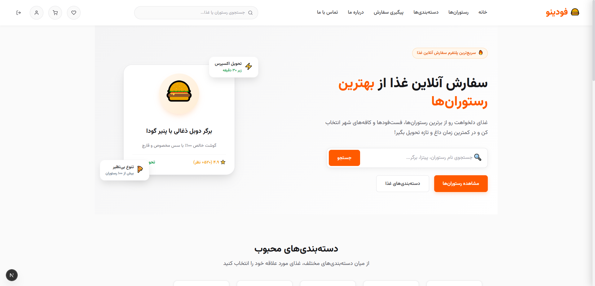
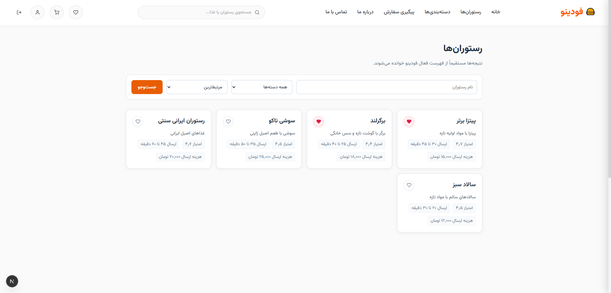
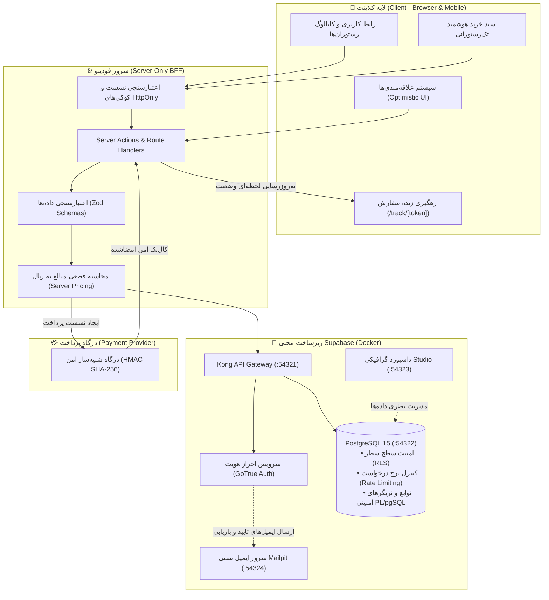

# فودینو (Foodino) — سامانه جامع سفارش آنلاین غذا

پلتفرم مدرن، امن و واکنش‌گرای سفارش آنلاین غذا، توسعه‌یافته با معماری **Server-Only Backend-For-Frontend (BFF)**، پایگاه‌داده قدرتمند **Supabase Postgres** و فریم‌ورک **Next.js 16 (App Router)** به زبان **TypeScript**.

---

## 📸 پیش‌نمایش رابط کاربری (UI Previews)

<div align="center">

### صفحه اصلی پلتفرم (Home Page)
*طراحی واکنش‌گرا (RTL)، دسته‌بندی‌های پویا، دسترسی به رستوران‌های برتر و پیگیری سفارش*



<br />

### کاتالوگ و فیلتر پیشرفته رستوران‌ها (Restaurants Catalog)
*فیلتر هوشمند بر اساس دسته‌بندی، امتیاز، زمان و هزینه ارسال با جستجوی لحظه‌ای*



</div>

---

## ✨ امکانات و قابلیت‌های کلیدی (Key Features)

### 🛒 بخش کاربران و خرید
- **کاتالوگ هوشمند رستوران‌ها**: جستجوی بلادرنگ، فیلتر دسته‌بندی پویا از دیتابیس، مرتب‌سازی بر اساس محبوب‌ترین، امتیاز و کمترین هزینه ارسال.
- **منوی تعاملی و محصولات**: انتخاب محصولات همراه با تنوع‌های انتخابی (Variants) و افزودنی‌ها (Addons).
- **سبد خرید هوشمند**: تغییر آنی تعداد، افزودن یادداشت به هر سفارش و جلوگیری از تداخل لجستیکی سفارش چندمبدأ (قانون سبد خرید تک‌رستورانی با هشدار تایید کاربر).
- **سیستم نشان‌کردن و علاقه‌مندی‌ها (Favorites)**: افزودن/حذف آنی با انیمیشن لمسی (Optimistic UI)، همراه با صفحه اختصاصی مدیریت علاقه‌مندی‌ها (`/favorite-restaurants`).
- **پیگیری بلادرنگ سفارش (Order Tracking)**: رهگیری مرحله‌به‌مرحله با توکن یکتای امن (`/track/[token]`) از وضعیت ثبت تا تحویل بدون نیاز به ورود اجباری.
- **پروفایل و دفترچه آدرس**: ویرایش مشخصات فردی و ثبت چندین نشانی تحویل به همراه اطلاعات موقعیتی و اعتبارسنجی کدپستی.
- **طراحی ریسپانسیو و دسترس‌پذیر**: بهینه‌سازی شده بر پایه اصول **Apple HIG** و وب مدرن، پشتیبانی کامل از صفحه‌کلید، فوکوس بصری و صفحات لمسی موبایل.
- **صفحه تماس با ما**: فرم ارتباطی یکپارچه، کارت موقعیت مکانی و پیوندهای مستقیم به اپلیکیشن‌های مسیریابی (نشان، بلد و Google Maps).

### 🛡️ پنل مدیریت و اپراتور
- **داشبورد مدیریت سفارش‌ها (`/operator/orders`)**: مشاهده زنده سفارش‌های ثبت‌شده بر اساس نقش کاربری و به‌روزرسانی گام‌به‌گام وضعیت سفارش (تأیید، آماده‌سازی، ارسال و تحویل).

---

## 🏛️ دیاگرام معماری و جریان داده (System Architecture & Flow)


```mermaid
flowchart TD
    subgraph Client ["📱 لایه کلاینت (Client - Browser & Mobile)"]
        UI["رابط کاربری و کاتالوگ رستوران‌ها"]
        Cart["سبد خرید هوشمند تک‌رستورانی"]
        Fav["سیستم علاقه‌مندی‌ها (Optimistic UI)"]
        Track["رهگیری زنده سفارش (/track/[token])"]
    end

    subgraph ServerBFF ["⚙️ سرور فودینو (Server-Only BFF)"]
        AuthMiddleware["اعتبارسنجی نشست و کوکی‌های HttpOnly"]
        ZodValidator["اعتبارسنجی داده‌ها (Zod Schemas)"]
        PricingEngine["محاسبه قطعی مبالغ به ریال (Server Pricing)"]
        Actions["Server Actions & Route Handlers"]
    end

    subgraph SupabaseDocker ["🐳 زیرساخت محلی Supabase (Docker)"]
        Kong["Kong API Gateway (:54321)"]
        Studio["داشبورد گرافیکی Studio (:54323)"]
        Mailpit["سرور ایمیل تستی Mailpit (:54324)"]
        GoTrue["سرویس احراز هویت (GoTrue Auth)"]
        Postgres[("PostgreSQL 15 (:54322)
        • امنیت سطح سطر (RLS)
        • کنترل نرخ درخواست (Rate Limiting)
        • توابع و تریگرهای امنیتی PL/pgSQL")]
    end

    subgraph Gateway ["💳 درگاه پرداخت (Payment Provider)"]
        BankMock["درگاه شبیه‌ساز امن (HMAC SHA-256)"]
    end

    UI --> AuthMiddleware
    Cart --> AuthMiddleware
    Fav --> Actions
    AuthMiddleware --> Actions
    Actions --> ZodValidator
    ZodValidator --> PricingEngine
    PricingEngine --> Kong
    Kong --> GoTrue
    Kong --> Postgres
    GoTrue -.->|ارسال ایمیل‌های تایید و بازیابی| Mailpit
    Studio -.->|مدیریت بصری داده‌ها| Postgres
    PricingEngine -->|ایجاد نشست پرداخت| BankMock
    BankMock -->|کال‌بک امن امضاشده| Actions
    Actions -->|به‌روزرسانی لحظه‌ای وضعیت| Track
```

---

## 🗄️ بک‌اند، زیرساخت و سرویس‌های محلی (Backend & Infrastructure)

سیستم فودینو در محیط توسعه از طریق **Docker** و کانتینرهای رسمی **Supabase Local** اجرا می‌شود:

| سرویس / ابزار | نشانی دسترسی لوکال | توضیحات کاربردی |
| :--- | :--- | :--- |
| **برنامه اصلی (Next.js)** | `http://localhost:3000` | رابط کاربری مشتریان و پنل اپراتور |
| **داشبورد گرافیکی داده‌ها (Supabase Studio)** | `http://localhost:54323` | مشاهده، ویرایش جداول، مانیتورینگ کاربران و کوئری‌های SQL به صورت ویژوال |
| **سرور ایمیل تستی (Inbucket / Mailpit)** | `http://localhost:54324` | دریافت و تست ایمیل‌های تایید ثبت‌نام، فراموشی رمز و لینک‌های جادویی |
| **درگاه API گیت‌وی (Kong Gateway)** | `http://localhost:54321` | نشانی پایه اندپوینت‌های REST و سیستم احراز هویت |
| **پایگاه‌داده رابطه‌ای PostgreSQL** | `localhost:54322` | اتصال مستقیم پایگاه داده برای کلاینت‌های SQL مانند DBeaver یا DataGrip |

### 🔒 امنیت و یکپارچگی داده‌ها
- **امنیت سطح سطر (RLS)**: ایزوله‌سازی دقیق داده‌های مشتریان (سفارش‌ها، آدرس‌ها، سبد و علاقه‌مندی‌ها) در سطح موتور Postgres.
- **احراز هویت امن (Supabase Auth)**: نشست‌های مبتنی بر کوکی‌های رمزنگاری‌شده `HttpOnly` با گزینه‌های `SameSite=Lax` و بررسی مبدأ درخواست (`assertSameOrigin`).
- **اعتبارسنجی دوطرفه (Zod Schemas)**: همگام‌سازی کامل شروط اعتبارسنجی ورودی‌ها (از جمله طول رمز عبور حداقل ۶ کاراکتر، ساختار آدرس و فرم‌ها) بین فرانت‌اند و بک‌اند.
- **محاسبات مالی قطعی (Deterministic Pricing)**: تمام محاسبات پولی، تخفیف، مالیات و پیک در سمت سرور به ریال (`IRR`) پردازش شده و ارقام ارسالی کلاینت نادیده گرفته می‌شوند.
- **کنترل نرخ درخواست (Distributed Rate Limiting)**: پیاده‌سازی اتمیک الگوریتم Token Bucket در اسکیما `private` پایگاه داده.
- **درگاه پرداخت ایمن و شبیه‌ساز (Mock Gateway)**: شبیه‌سازی دقیق چرخه پرداخت بانکی با امضای هش کال‌بک (`HMAC SHA-256`) و معماری Fail-Closed در محیط پروداکشن.

---

## 🛠️ پشته فناوری (Technology Stack)

- **فریم‌ورک فرانت‌اند و سرور**: Next.js 16.3 (App Router & Turbopack)
- **کتابخانه رابط کاربری**: React 19
- **زبان برنامه‌نویسی**: TypeScript 5.9 (Strict Mode)
- **سامانه استایل‌دهی**: styled-components 6.5 با SSR Style Registry
- **پایگاه داده و احراز هویت**: Supabase Postgres (PL/pgSQL + RLS Policies)
- **موتورهای آزمون**: Vitest 4.1 (Unit/Integration)، pgTAP (Database Tests) و Playwright 1.62 (E2E)

---

## 🚀 راه‌اندازی سریع در محیط لوکال (Local Setup)

### پیش‌نیازها
- **Node.js**: نسخه 24 به بالا
- **Docker Desktop**: جهت اجرای کانتینرهای پایگاه‌داده و سرویس‌های سوپابیس
- **Supabase CLI**: نسخه 2.116 به بالا

### دستورات راه‌اندازی
```bash
# ۱. نصب وابستگی‌های پکیج
npm ci

# ۲. روشن کردن کانتینرهای دیتابیس، استودیو و ایمیل سرور
npm run db:start

# ۳. اعمال مایگریشن‌ها و داده‌های اولیه تستی
npm run db:reset

# ۴. اجرای سرور توسعه با متغیرهای محیطی محلی
npm run dev:local
```

برنامه در نشانی `http://localhost:3000` و پنل کار با دیتابیس در `http://localhost:54323` در دسترس خواهند بود.

---

## ⚙️ متغیرهای محیطی (.env)

فایل `.env.example` شامل متغیرهای مورد نیاز برای اجرای برنامه است:
- `APP_URL`: نشانی پایه برنامه (مثلاً `http://127.0.0.1:3000`)
- `SUPABASE_URL`: نشانی سرور API محلی یا ابری Supabase (`http://127.0.0.1:54321`)
- `SUPABASE_PUBLISHABLE_KEY`: کلید عمومی کلاینت (Anon Key)
- `SUPABASE_SECRET_KEY`: کلید محرمانه سمت سرور (`service_role`) برای دسترسی‌های مدیریت
- `PAYMENT_PROVIDER`: مقدار `development` در محیط تست محلی و `disabled` در پروداکشن
- `PAYMENT_CALLBACK_SECRET`: رشته امن حداقل ۳۲ حرفی برای اعتبارسنجی کال‌بک درگاه بانکی
- `RATE_LIMIT_ADAPTER`: آداپتر تشخیص IP کلاینت (`vercel` یا `trusted-reverse-proxy`)
- `TRUSTED_PROXY_HOPS`: تعداد پروکسی‌های مورد اعتماد پیش از وب‌سرور (پیش‌فرض: `1`)
- `SMTP_CONFIGURED`: وضعیت فعال‌سازی ارسال ایمیل واقعی (`true` یا `false`)

---

## 🧪 فرامین کنترل کیفی و تست‌ها (Verification Commands)

```bash
# بررسی کیفیت کد و استانداردها
npm run lint

# بررسی تطابق نوع‌های داده TypeScript
npm run typecheck

# اجرای تمام آزمون‌های واحد و دامنه
npm run test

# گزارش درصد پوشش آزمون‌ها (Coverage Report)
npm run test:coverage

# اعتبارسنجی تایپ‌های تولیدشده از روی شمای دیتابیس
npm run db:types:check

# اجرای آزمون‌های در سطح پایگاه داده با pgTAP
npm run db:test

# اجرای تست‌های سرتاسری مرورگر با Playwright
npm run test:e2e
```

---

## 👤 ایجاد و دسترسی اپراتور سیستم (Operator Setup)

برای اختصاص دسترسی اپراتوری به یک حساب:
1. در صفحه ورود/ثبت‌نام، کاربر را ایجاد کنید یا از پنل Supabase Studio یک حساب بسازید.
2. در جدول `auth.users`، ستون `app_metadata` را ویرایش کرده و مقدار `{"role": "operator"}` را قرار دهید.
3. با ورود به سامانه، دسترسی به مسیر مدیریت سفارش‌ها (`/operator/orders`) فعال خواهد شد.

---

## 📄 مستندات تصمیم‌گیری‌های معماری (Architecture Decision Records)

جزئیات عمیق‌تر تصمیم‌های فنی در پوشه `docs/adr/` ثبت شده است:
* `0001-supabase-server-only-bff.md`: جداسازی دسترسی مستقیم کلاینت و الگوی BFF
* `0002-styled-components-ssr.md`: تزریق استایل‌ها در رندر سرور Next.js
* `0003-single-restaurant-cart.md`: معماری سبد خرید تک‌رستورانی
* `0004-money-irr-integer-pricing.md`: محاسبات مالی با عدد صحیح ریال و تفکیک لایه ارائه تومان
* `0005-fail-closed-payment-adapter.md`: معماری تطبیق‌دهنده پرداخت با استراتژی Fail-Closed
* `0006-persian-only-v1-rtl.md`: استانداردسازی تجربه کاربری فارسی و راست‌چین
