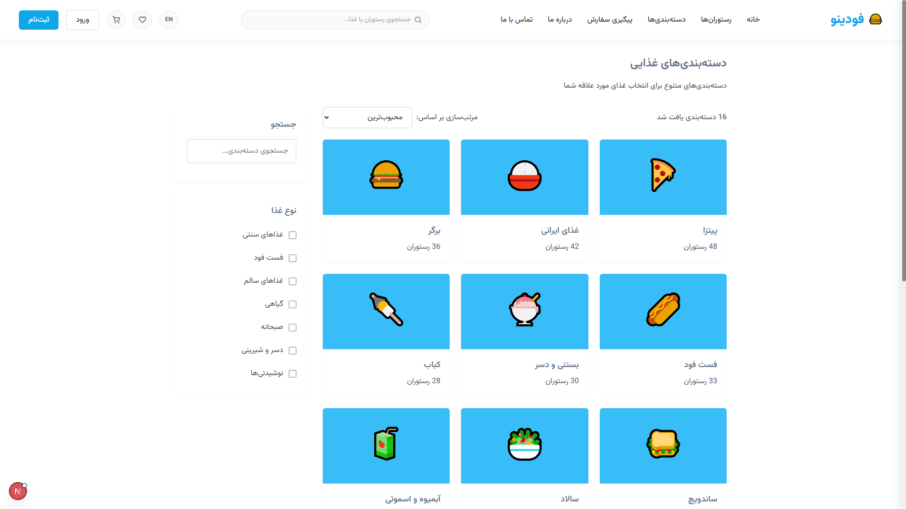

# Foodino 🍕


A modern, responsive online food ordering platform built with Next.js 14, TypeScript, and styled-components. Foodino provides a seamless experience for browsing restaurants, ordering food, and tracking deliveries.

## 📋 Table of Contents

- [Features](#-features)
- [Screenshots](#-screenshots)
- [Technology Stack](#-technology-stack)
- [Getting Started](#-getting-started)
- [Project Structure](#-project-structure)
- [Key Functionality](#-key-functionality)
- [Roadmap](#-roadmap)
- [Contributing](#-contributing)
- [License](#-license)

## ✨ Features

- **Responsive Design** - Fully optimized for mobile, tablet, and desktop devices
- **RTL Support** - Complete Persian language support with right-to-left layout
- **Restaurant Discovery** - Browse and search restaurants by category, cuisine, or name
- **Menu Management** - View detailed restaurant menus with prices and descriptions
- **Shopping Cart** - Interactive cart with real-time updates and quantity control
- **User Profiles** - Secure authentication with user preferences and order history
- **Favorites** - Save and manage your favorite restaurants
- **Order Tracking** - Real-time order status and delivery tracking
- **Theme Switching** - Toggle between light and dark modes
- **Multi-language** - Switch between Persian and English interfaces

## 📸 Screenshots

*Add your screenshots here to showcase the application's UI. For example:*

<div align="center">
  
  
</div>

<div align="center">
  
  
</div>

## 🛠️ Technology Stack

- **Frontend Framework**: [Next.js 14](https://nextjs.org/) with App Router
- **Programming Language**: [TypeScript](https://www.typescriptlang.org/)
- **Styling Solution**: [styled-components](https://styled-components.com/) with custom theming
- **State Management**: React Context API and custom hooks
- **Fonts**: Vazirmatn (Google Fonts)
- **Icons**: [Feather Icons](https://feathericons.com/)
- **Responsive Design**: Mobile-first approach with flexible layouts
- **Localization**: Custom translation system

## 🚀 Getting Started

### Prerequisites

- Node.js (v18.0.0 or later)
- npm or yarn

### Installation

1. Clone the repository

```bash
git clone https://github.com/Pezhm4n/Foodino---Online-Food-Ordering-Platform.git
   cd Foodino---Online-Food-Ordering-Platform
```

2. Install dependencies

```bash
npm install
# or
yarn install
```

3. Run the development server

```bash
npm run dev
# or
yarn dev
```

4. Open [http://localhost:3000](http://localhost:3000) in your browser

### Building for Production

```bash
npm run build
npm run start
# or
yarn build
yarn start
```

## 📁 Project Structure

```
foodino/
├── public/          # Static assets
├── src/
│   ├── app/         # Next.js App Router pages and layouts
│   ├── components/  # Reusable React components
│   ├── contexts/    # React Context providers
│   ├── data/        # Sample data and mock APIs
│   ├── hooks/       # Custom React hooks
│   ├── lib/         # Utility functions and helpers
│   ├── styles/      # Global styles and theme definitions
│   ├── types/       # TypeScript type definitions
│   └── locales/     # Translation files
├── .gitignore
├── next.config.js
├── package.json
├── README.md
└── tsconfig.json
```

## 🔑 Key Functionality

### Restaurant Browsing

Users can browse through restaurants, filter by categories, and search by name or cuisine type. Each restaurant displays essential information such as rating, delivery time, and minimum order amount.

### Menu Navigation

Restaurant pages display categorized menu items with detailed descriptions, prices, and customization options. Users can view ingredients and dietary information for each dish.

### Cart Management

The cart system provides real-time updates as users add, remove, or modify items. It includes quantity controls, subtotal calculation, and checkout options.

### User Authentication

Secure user registration and login flow with profile management. Users can save delivery addresses, payment methods, and preferences.

### Order Processing

Complete order flow from cart checkout to confirmation, with order tracking and delivery status updates.

## 🗺️ Roadmap

- [ ] Payment gateway integration
- [ ] Advanced search filters and sorting options
- [ ] User reviews and rating system
- [ ] Restaurant owner dashboard
- [ ] Push notifications for order updates
- [ ] Delivery driver mobile application
- [ ] Loyalty points and rewards system
- ...

## 👥 Contributing

Contributions are welcome! Please feel free to submit a Pull Request.

1. Fork the repository
2. Create your feature branch (`git checkout -b feature/amazing-feature`)
3. Commit your changes (`git commit -m 'Add some amazing feature'`)
4. Push to the branch (`git push origin feature/amazing-feature`)
5. Open a Pull Request

## 📄 License
    ...
---

<div align="center">
  <p>Built with ❤️ by <a href="https://github.com/Pezhm4n">Pezhman</a> using Cursor AI</p>
</div>
